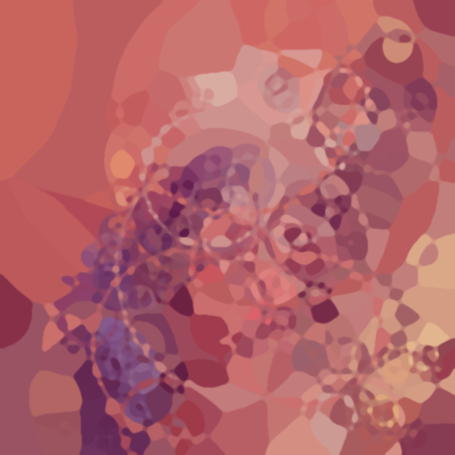

# Examples

## Colormaps
The image can be colorized by OpenCV's colormaps instead of using the original image as color template. This can be done by specifying the name of colormap by `-c` option (see [OpenCV documentation](https://docs.opencv.org/4.4.0/d3/d50/group__imgproc__colormap.html#ga9a805d8262bcbe273f16be9ea2055a65) for the detailed view of all colormaps with images). The color depends on the x a y coordinates of each area (but also on implementation of selected mode). This can be prevented by randomizing the colors by using `-r` flag, as seen in the second row of the displayd examples:\

| bone | cividis | turbo| twilight |
| --- | --- | --- | --- |
|         |         |         |  |
|  |  |  |  |

## Smoothing
Without any smoothing the edges of areas are quite hard and unpleasant. To avoid this, level of edge smoothing can be defined by `-s` option:

| 0 | 3 | 10 | 20 |
| --- | --- | --- | --- |
|  |  |  |  |

## Modes
### sobel
| default | -o ,10 | -o ,100 | -o 0,30,0 |
| --- | --- | --- | --- |
|  |  |  |  |
|  |  |  |  |
|  |  |  |  |

### kmeans-circles
| default | -o ,30,5 | -o 1,,3,14,2 | -o ,,20,30,2 |
| --- | --- | --- | --- |
|  |  |  |  |
|  |  |  |  |
|  |  |  |  |

### kmeans-lines
| default | -o ,,1  | -o ,,5,10 | -o ,,5,100 |
| --- | --- | --- | --- |
|  |  |  |  |
|  |  |  |  |
|  |  |  |  |

### sift-circles
| default | -o 0,,5,0.6 | -o 3,,,0.5 | -o ,,1,2 |
| --- | --- | --- | --- |
|  |  |  |  |
|  |  |  |  |
|  |  |  |  |

### sift-lines
| default | -o 0 | -o 3,20, | -o 1,100 |
| --- | --- | --- | --- |
|  |  |  |  |
|  |  |  |  |
|  |  |  |  |

